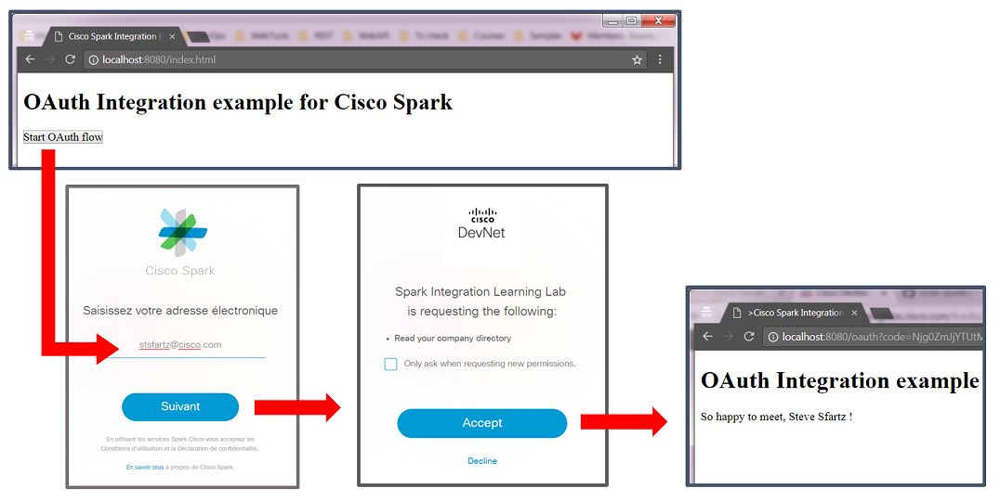
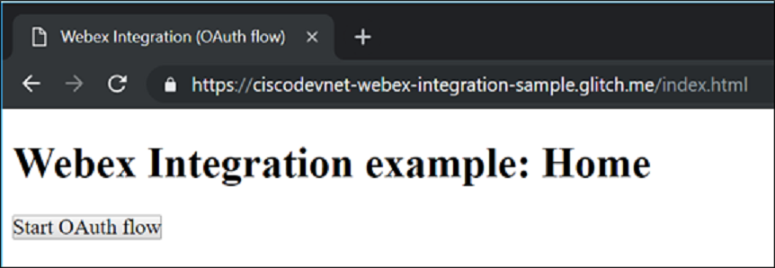
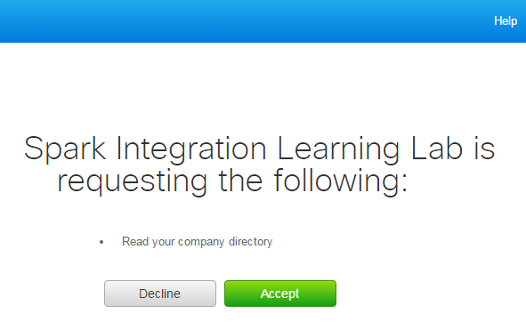
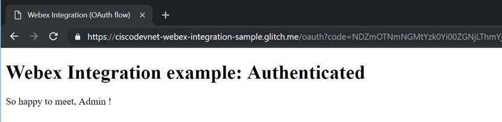
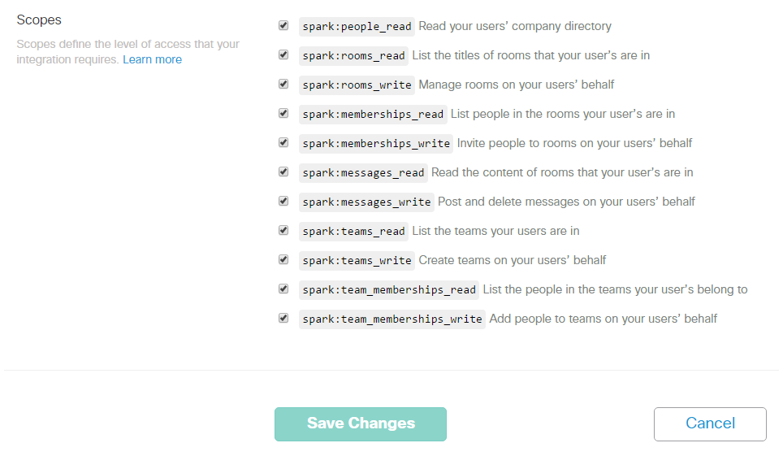
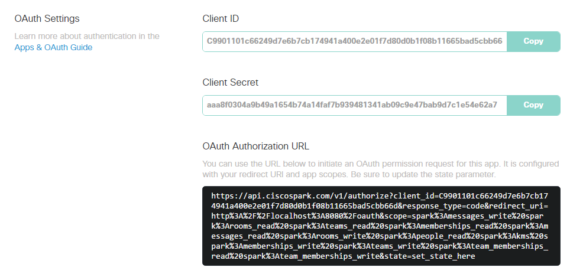

# Example of Cisco Spark Integration (OAuth flow) in NodeJS

This Spark Integration example illustrates an OAuth Grant flow at the end of which the Spark User who granted permission will see his full name displayed.

It comes as a companion to the [DevNet Learning Lab about creating Cisco Spark OAuth integrations](https://learninglabs.cisco.com/tracks/collab-cloud/spark-apps/collab-spark-intl/step/1).




This example leverages a pre-registered Spark integration with a Redirect URL on localhost so that it can be run with minimal setup.
The flow initiates at http://localhost:8080/, and Cisco Spark Oauth Flow redirects to http://localhost:8080/oauth

In real world, you'll register and deploy your integration on a public URL, check the guide below to [register your own integration](#https://github.com/CiscoDevNet/spark-integration-sample#to-register-your-own-spark-oauth-integration).


## Run it locally

This example leverages a pre-registered Spark integration with a Redirect URL on localhost so that it can be run with minimal setup:

``` bash
> git clone https://github.com/CiscoDevNet/spark-integration-sample
> cd spark-integration-sample
> npm install
> make
DEBUG=oauth* REDIRECT_URI="http://localhost:8080/oauth" CLIENT_ID="C4ae9568c6cf4576abbc58c183b69f466c6ea6a7d3b8f0f22a60d6775f36d5aed" CLIENT_SECRET="772c2882806539bee681288640608f5ec2e6afbc11010e74d8bd11c941893096" node server.js
oauth Cisco Spark OAuth Integration started on port: 8080 +0ms
```

You're all set, your integration is live ! 
Now, let's go through the OAuth flow.

Start by opening the Spark integration home page hosted at [http://localhost:8080](http://localhost:8080):



Click Start, specify your Spark account email and accept (or decline) the authorization scopes:


 
If you accepted, the Spark integration you're running locally just got issued an Access Token that can now act on your behalf.
The integration custom code logic asks Cisco Spark for your Person details and displays your full name.




## How to register your own Spark OAuth Integration

To learn more about Cisco Spark Integration, [read the reference documentation](https://developer.ciscospark.com/authentication.html).

In the example above, we were running a pre-registered OAuth integration.
Let's now register our own Cisco Spark integration.

Go to [Spark for developers](https://developer.ciscospark.com) portal, click Apps, add Apps, and then [create an integration](https://developer.ciscospark.com/add-integration.html).

> The step by step guide below shows how to register a Spark Integration running on your local machine (localhost).
> In the real-world, you will want to deploy your integration on the internet, and register its public URL rather than your local machine.


Select all OAuth scopes by default, or simply go with the limited set of permissions your code really needs. 
Note that even though we chose ALL scopes for now, we will [refine the scopes later in our code](https://github.com/CiscoDevNet/spark-integration-sample/blob/master/server.js#L30) in order to conform to our code's real needs.



Click save, and report your client id and client secret:
- into [your code](https://github.com/CiscoDevNet/spark-integration-sample/blob/master/server.js#L26),
- or set these env variables in a command shell: CLIENT\_ID, CLIENT\_SECRET, REDIRECT\_URI, STATE
- or update the run command in your Project's [Makefile](https://github.com/CiscoDevNet/spark-integration-sample/blob/master/Makefile).



You're all set.
Start your integration, and give it a try !


## More about Cisco Spark integrations ?

Spark Apps incarn Cisco Spark’s extensibility. 

By creating custom Spark apps, developers can tie together existing software with Cisco Spark and instantly promote their Apps. 
For example, add the “Jira Integration” (https://depot.ciscospark.com/integrations/Y2lzY29zcGFyazovL3VzL0FQUExJQ0FUSU9OLzQwYjk2ZTQzLTZkNmQtNDJjZS1iODk0LWU0MmVhNWJjMDJmNA) to Rooms and your teams will be notified as Jira issues (whether EPIC, Story, Task or Bugs) are updated.

Spark integrations are a way for your apps to request permission to invoke the Spark APIs on behalf of other Spark users. 
The process used to request permission is called an OAuth Grant Flow, and is documented in the Integrations (https://developer.ciscospark.com/authentication.html ) guide. 

You can experiment the flow in DevNet Learning lab [“Understand the OAuth Grant flow of Spark Integrations”](https://learninglabs.cisco.com/tracks/collab-cloud/business-messaging/collab-spark-auth/step/1).
